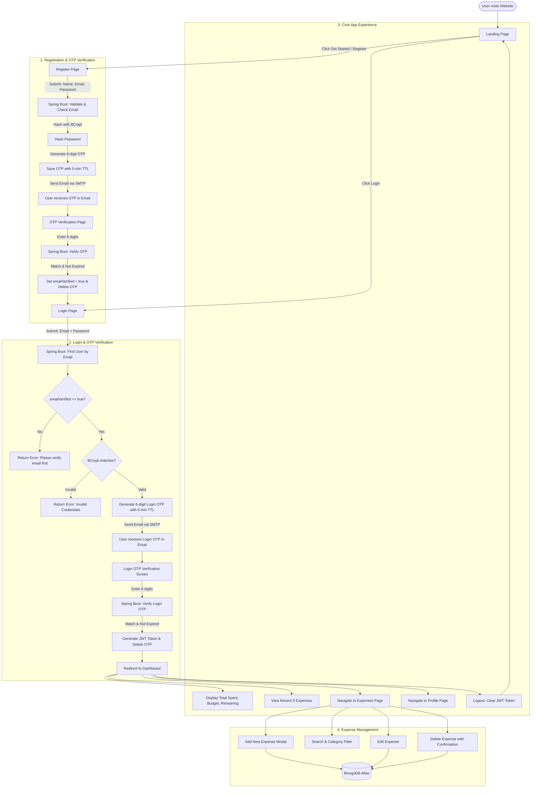

# Architecture & Project Tree Map

## Student Expense Tracker

A full-stack, cloud-ready web application designed for students to seamlessly manage and track daily expenses, featuring secure Email + Password registration with 6-digit OTP verification, two-step Email + Password + OTP login, JWT-based session security, and MongoDB Atlas persistence.

---

## 1. Complete Project Tree Map

The directory structure of the repository follows clean architecture, strict separation of concerns, and cloud-native standards.

```text
ExpenseTracker/
│
├── .gitignore                                # Root Git ignore file (node_modules, target, .env, secrets)
├── README.md                                 # Complete project overview, setup, and developer guide
├── ARCHITECTURE.md                           # System architecture, complete tree map, and data flows
├── API_SPECIFICATION.md                      # Comprehensive REST API contracts, payloads, and status codes
├── DATABASE_SCHEMA.md                        # MongoDB Atlas collection schemas, indexing, and aggregation pipelines
├── DEPLOYMENT_GUIDE.md                       # Production deployment guide for Vercel, Railway, and MongoDB Atlas
│
├── expense-tracker-backend/                  # Java / Spring Boot 3+ REST API Backend
│   ├── .mvn/                                 # Maven wrapper directory
│   │   └── wrapper/
│   │       ├── maven-wrapper.jar             # Maven wrapper binary
│   │       └── maven-wrapper.properties      # Maven wrapper configuration
│   ├── mvnw                                  # Maven wrapper script for Unix / macOS
│   ├── mvnw.cmd                              # Maven wrapper script for Windows
│   ├── pom.xml                               # Maven project dependencies and build configuration
│   └── src/
│       ├── main/
│       │   ├── java/
│       │   │   └── com/
│       │   │       └── expensetracker/
│       │   │           └── backend/
│       │   │               ├── BackendApplication.java       # Spring Boot main application entrypoint
│       │   │               │
│       │   │               ├── config/                       # Application & security configuration
│       │   │               │   ├── CorsConfig.java           # Cross-Origin Resource Sharing configuration
│       │   │               │   ├── MongoConfig.java          # MongoDB auditing & index lifecycle config
│       │   │               │   └── EmailConfig.java          # JavaMailSender setup and custom mail properties
│       │   │               │
│       │   │               ├── controller/                   # REST API Controllers (HTTP endpoints)
│       │   │               │   ├── AuthController.java       # /api/auth (register, verify, resend, login, verify-login, resend-login-otp)
│       │   │               │   ├── ExpenseController.java    # /api/expenses (CRUD, search, filtering)
│       │   │               │   ├── DashboardController.java  # /api/dashboard (summary metrics & recent items)
│       │   │               │   └── UserController.java       # /api/users (profile get and update)
│       │   │               │
│       │   │               ├── dto/                          # Data Transfer Objects (request/response models)
│       │   │               │   ├── request/
│       │   │               │   │   ├── RegisterRequest.java          # Name, email, password, confirmPassword
│       │   │               │   │   ├── VerifyOtpRequest.java         # Email, 6-digit OTP code
│       │   │               │   │   ├── ResendOtpRequest.java         # Email
│       │   │               │   │   ├── LoginRequest.java             # Email, password
│       │   │               │   │   ├── ExpenseRequest.java           # Amount, category, description, date, paymentMethod
│       │   │               │   │   └── UpdateProfileRequest.java     # Name, monthlyBudget
│       │   │               │   └── response/
│       │   │               │       ├── ApiResponse.java              # Standard generic API wrapper
│       │   │               │       ├── AuthResponse.java             # JWT token, user summary, expiry
│       │   │               │       ├── DashboardResponse.java        # Spent, budget, remaining, recent list
│       │   │               │       ├── ExpenseResponse.java          # Formatted expense with id and timestamps
│       │   │               │       └── UserProfileResponse.java      # User profile, verified status, member date
│       │   │               │
│       │   │               ├── exception/                    # Global exception handling
│       │   │               │   ├── GlobalExceptionHandler.java   # @ControllerAdvice for uniform error responses
│       │   │               │   ├── ResourceNotFoundException.java# Custom 404 exception
│       │   │               │   ├── InvalidOtpException.java      # Custom 400 exception for expired/wrong OTP
│       │   │               │   └── UnauthorizedException.java    # Custom 401 exception for bad credentials
│       │   │               │
│       │   │               ├── model/                        # MongoDB Document Entities (@Document)
│       │   │               │   ├── User.java                 # 'users' collection (id, name, email, password, emailVerified, budget)
│       │   │               │   ├── RegistrationOtp.java      # 'registration_otps' collection (id, email, otp, type, expiresAt)
│       │   │               │   └── Expense.java              # 'expenses' collection (id, userId, amount, category, description, paymentMethod, date)
│       │   │               │
│       │   │               ├── repository/                   # Spring Data MongoDB Repositories
│       │   │               │   ├── UserRepository.java           # MongoRepository<User, String>
│       │   │               │   ├── RegistrationOtpRepository.java# MongoRepository<RegistrationOtp, String>
│       │   │               │   └── ExpenseRepository.java        # MongoRepository<Expense, String>
│       │   │               │
│       │   │               ├── security/                     # Spring Security & JWT Implementation
│       │   │               │   ├── SecurityConfig.java           # SecurityFilterChain, CSRF, SessionManagement, BCrypt
│       │   │               │   ├── JwtService.java               # Token generation, claims extraction, validation
│       │   │               │   ├── JwtAuthenticationFilter.java  # OncePerRequestFilter for Bearer token extraction
│       │   │               │   └── CustomUserDetailsService.java # UserDetailsService loading from UserRepository
│       │   │               │
│       │   │               └── service/                      # Business Logic Layer
│       │   │                   ├── AuthService.java          # Registration, password hashing, login token issuing
│       │   │                   ├── OtpService.java           # 6-digit OTP generation, validation, expiry, email trigger
│       │   │                   ├── EmailService.java         # Spring JavaMailSender implementation for HTML/plain emails
│       │   │                   ├── ExpenseService.java       # Expense CRUD, date filtering, category aggregations
│       │   │                   ├── DashboardService.java     # Aggregation of total spent, remaining balance, latest 5
│       │   │                   └── UserService.java          # Profile fetching, name/budget updates
│       │   │
│       │   └── resources/
│       │       ├── application.properties    # Base Spring configuration (MongoDB, Mail, JWT, Server port)
│       │       └── application-prod.properties # Production profile properties for Railway deployment
│       │
│       └── test/
│           └── java/
│               └── com/
│                   └── expensetracker/
│                       └── backend/
│                           └── BackendApplicationTests.java  # Spring Boot Context load test
│
└── expense-tracker-frontend/                 # Next.js 14/15 App Router + React + TypeScript + Tailwind CSS
    ├── .env.example                          # Sample frontend environment file (NEXT_PUBLIC_API_URL)
    ├── .gitignore                            # Frontend Git ignore rules
    ├── package.json                          # Frontend dependencies (React, Next.js, Lucide, Tailwind, Axios)
    ├── tsconfig.json                         # TypeScript compiler configuration
    ├── tailwind.config.ts                    # Tailwind CSS theme, font, and plugin setup
    ├── postcss.config.js                     # PostCSS config for Tailwind CSS
    ├── next.config.js                        # Next.js runtime & image domain configuration
    │
    ├── public/                               # Static assets
    │   ├── favicon.ico                       # Favicon icon
    │   └── icons/                            # Web icons and illustrations
    │
    ├── app/                                  # Next.js App Router Pages & Layouts
    │   ├── layout.tsx                        # Root layout wrapping Navbar, fonts, and Toast/Alert providers
    │   ├── page.tsx                          # Landing Page (Hero section, Features, CTAs)
    │   ├── globals.css                       # Global styles, Tailwind base directives
    │   │
    │   ├── (auth)/                           # Auth route group
    │   │   ├── register/
    │   │   │   └── page.tsx                  # Registration form (Name, Email, Password, Confirm Password)
    │   │   ├── verify-otp/
    │   │   │   └── page.tsx                  # 6-digit OTP input boxes, countdown timer, Resend OTP (Registration & Login)
    │   │   └── login/
    │   │       └── page.tsx                  # Email + Password credentials form (Triggers login OTP)
    │   │
    │   ├── dashboard/
    │   │   └── page.tsx                      # Dashboard view (Summary cards, Recent 5 expenses, Quick actions)
    │   │
    │   ├── expenses/
    │   │   └── page.tsx                      # Expense management (Search bar, category filter, table, pagination)
    │   │
    │   └── profile/
    │       └── page.tsx                      # User profile (Name, Email, Verification badge, Budget configuration)
    │
    ├── components/                           # Reusable UI Components
    │   ├── Navbar.tsx                        # Responsive navigation bar (Dynamic for guest vs logged-in user)
    │   ├── Footer.tsx                        # Clean landing page footer
    │   ├── SummaryCard.tsx                   # Dashboard metric card (Total Spent, Monthly Budget, Remaining)
    │   ├── ExpenseForm.tsx                   # Modal/Drawer form for adding and editing expenses
    │   ├── ExpenseTable.tsx                  # Responsive table with inline Edit & Delete actions
    │   ├── DeleteModal.tsx                   # Confirmation modal for expense deletion
    │   ├── OtpInput.tsx                      # Auto-focusing 6-box OTP entry component
    │   └── ProtectedRoute.tsx                # Client-side JWT verification and redirect guard
    │
    ├── lib/                                  # Utility Libraries & API Clients
    │   ├── api.ts                            # Axios instance with Authorization header interceptor
    │   ├── auth.ts                           # Token storage helper (localStorage / cookies), logout handler
    │   └── utils.ts                          # Currency formatter (₹ INR), date helpers, classnames merger
    │
    └── types/                                # TypeScript Interfaces & Types
        ├── auth.ts                           # User, AuthState, LoginCredentials, RegisterPayload
        ├── expense.ts                        # Expense, ExpenseCategory, PaymentMethod, ExpenseSummary
        └── api.ts                            # Generic ApiResponse<T>, ErrorResponse
```

---

## 2. High-Level System Architecture

```text
               +-------------------------------------------------------+
               |                       CLIENT                          |
               |       Browser (Desktop / Mobile / Tablet)             |
               +---------------------------+---------------------------+
                                           |
                                           | HTTPS
                                           v
               +-------------------------------------------------------+
               |                  FRONTEND HOSTING                     |
               |                       Vercel                          |
               |                                                       |
               |   Next.js App Router (React + TypeScript + Tailwind)  |
               |   - Landing Page                                      |
               |   - Register & 6-Box OTP Verification                 |
               |   - Single-Factor Login (Email + Password)            |
               |   - Expense Dashboard & CRUD                          |
               |   - Profile & Budget Settings                         |
               +---------------------------+---------------------------+
                                           |
                                           | REST API (JSON / Bearer Token)
                                           v
               +-------------------------------------------------------+
               |                  BACKEND HOSTING                      |
               |                      Railway                          |
               |                                                       |
               |     Spring Boot 3+ Application (Java 21/23)           |
               |                                                       |
               |  [ Security Layer ]                                   |
               |    - Spring Security Filter Chain                     |
               |    - BCrypt Password Encoder                          |
               |    - JwtAuthenticationFilter (HMAC-SHA256)            |
               |                                                       |
               |  [ Business Logic Layer ]                             |
               |    - AuthService (Registration, Login, JWT Issuance)  |
               |    - OtpService (Secure 6-digit generation & TTL)     |
               |    - EmailService (JavaMailSender / SMTP delivery)    |
               |    - ExpenseService (Expense CRUD & Category Metrics) |
               |    - DashboardService (Spent, Budget, Remaining)      |
               +-----------------+-------------------+-----------------+
                                 |                   |
            MongoDB Wire Protocol|                   | SMTP TLS
                                 v                   v
+------------------------------------+   +------------------------------------+
|          DATABASE CLUSTER          |   |          EMAIL SERVICE             |
|           MongoDB Atlas            |   |       Gmail / SendGrid / SMTP      |
|                                    |   |                                    |
| Collections:                       |   | Delivers 6-digit verification code |
|  - users                           |   | directly to student's inbox.       |
|  - registration_otps (TTL 5 mins)  |   +------------------------------------+
|  - expenses                        |
+------------------------------------+
```

---

## 3. End-to-End Application Flow



---

## 4. Key Architectural Decisions

### 4.1. Two-Step Authentication with OTP for Registration and Login
- **Design Choice**: 6-digit OTP verification is required for both account registration and every user login.
- **Rationale**: Registration OTP confirms student email ownership before the account is activated. Login OTP ensures secure two-step authentication, protecting student financial and expense data even if passwords are compromised.

### 4.2. Stateless JWT Authentication
- The backend remains completely stateless.
- Every authenticated request from Next.js carries the `Authorization: Bearer <jwt_token>` header.
- The `JwtAuthenticationFilter` intercepts requests, extracts the user's email/ID, and establishes the `SecurityContext`.

### 4.3. Data Isolation by `userId`
- Every `Expense` document in MongoDB contains a foreign reference `userId`.
- All service operations (`findExpenses`, `addExpense`, `updateExpense`, `deleteExpense`) explicitly query `userId` extracted from the authenticated JWT, preventing cross-tenant data leakage.

### 4.4. Temporary OTP Lifecycle
- OTP documents are persisted in `registration_otps` with an `expiresAt` timestamp.
- Upon successful verification, the record is immediately removed.
- An automatic TTL index on `expiresAt` purges abandoned OTPs after 300 seconds (5 minutes).
